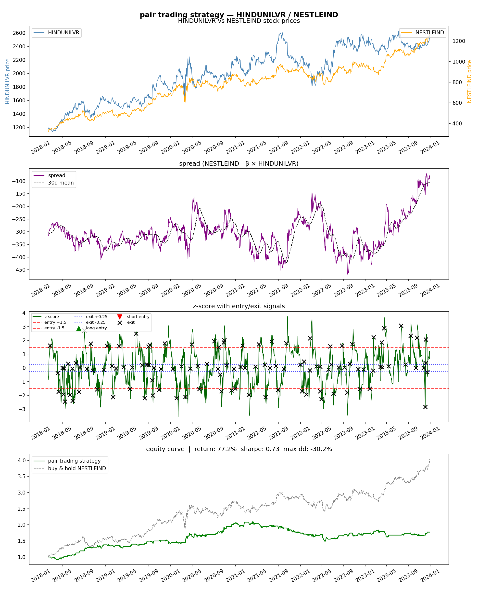

# pair trading strategy

built this to explore statistical arbitrage on Indian stocks. 
found that HINDUNILVR and NESTLEIND are cointegrated which means 
their prices tend to move together over time — and when they 
diverge, they usually come back.

## results

| metric | value |
|--------|-------|
| total return | 77.24% |
| sharpe ratio | 0.73 |
| max drawdown | -30.24% |
| total trades | 117 |
| period | 2018 – 2024 |

## strategy chart



## how it works

pretty simple idea honestly:

1. find two stocks that move together (cointegration test)
2. calculate the spread between them
3. track how far the spread deviates (z-score)
4. when spread gets too wide → trade expecting it to close
5. exit when it comes back to normal

```
entry when z-score crosses ±1.5
exit when z-score returns to ±0.25
```

## cointegration test results

- p-value: **0.0215** — cointegrated ✅
- ADF test p-value: **0.0251** — spread is mean reverting ✅
- hedge ratio β: **0.5379**

## what i used

- `yfinance` — pulling stock data
- `statsmodels` — cointegration and ADF tests
- `pandas` / `numpy` — data processing
- `matplotlib` — charts

## run it yourself

```bash
pip install yfinance statsmodels pandas numpy matplotlib
python pair_trading.py
```

## what pair trading actually is

two stocks that usually move together will sometimes 
drift apart. when that happens you buy the one that 
fell behind and sell the one that ran ahead. 
when they come back together you close both and take profit.

it's market neutral — you make money from the 
*relationship* between stocks, not from the market going up or down.
